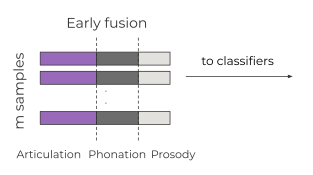
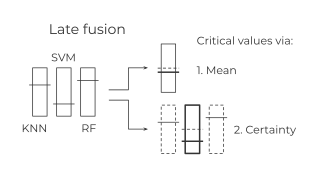
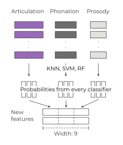
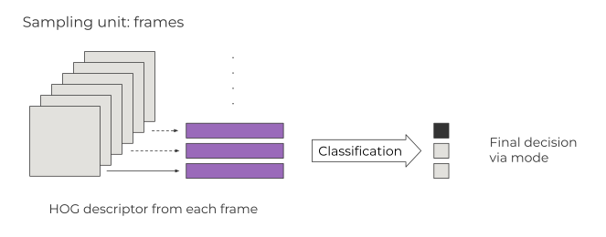

## Early Fusion
*Available for: DisVoice*  
  
Concatenates **multiple** feature types extracted from the **same** input sample. Forms a longer feature vector per sample, which is treated as classifier inputs.

## Classifier Late Fusion
*Available for: DisVoice, FaceMesh*  
  
After **independent** label probability estimates by **multiple** classifiers, combine estimates to form final decision for each sample using the following strategies:
- Mean: check on which side of threshold (0.5 for binary classification) the average of predicted probabilities lies.
- Certainty: only use the classifier probability furthrest from the threshold (most extreme) to make the decision.

## Probability Fusion
*Available for: DisVoice*  
  
After classifiers individually obtain their probabilities predictions using one or more feature types, concatenate probability scores across classifiers and then across features. These new **vectors of scores** becomes new input for the **2nd round** of classification.

## Feature Late Fusion
*Available for: FaceMesh*  
  
If multiple (instead of 1) feature vectors are produced per sample, first assign labels for all feature vectors independently. Then, use **the mode** of all labels for feature vectors **from the same sample** to obtain a sample level decision.
